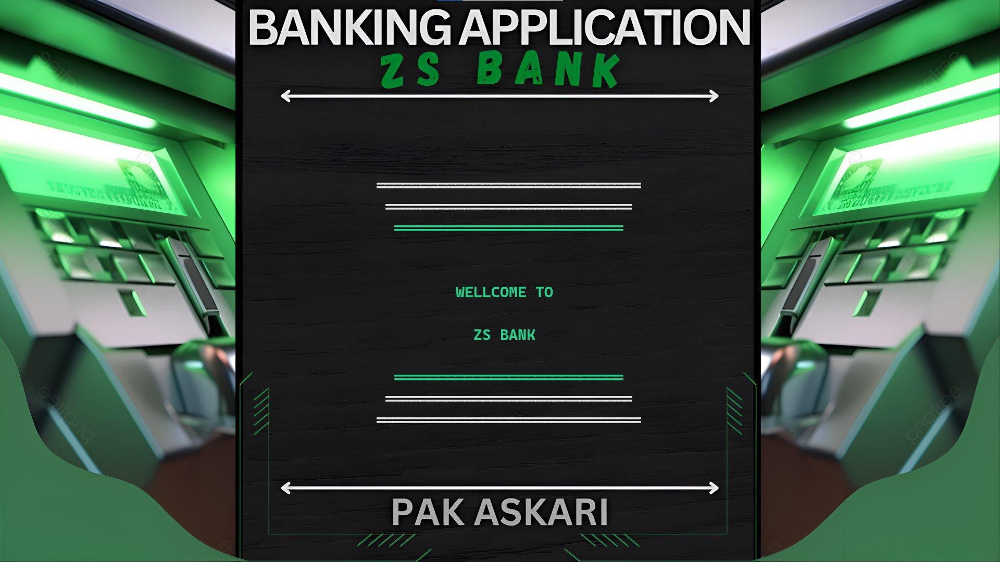

# 💳 Real-Time Banking Application (C++ + Python)

# 📸 Screenshot


🎖️ **🏆 3rd Place - STEAM National Exhibition 2025**  
🎖️ **🥇 1st Place - Regional STEAM Festival 2025**

A powerful banking application written in C++ with real-time features, terminal-based UI, and voice assistant integration using Python.

---
## 💡 Key Features

-✅ 3,000+ lines of code — clean, modular, and powerful
- 🎮 ATM Simulation with PIN-based access
- 💬 Real-time message system via Python (`pywhatkit`)
- 🧾 Loan Request and Approval system (Manager ↔ User)
- 📈 Transaction Logging & Error Handling
- 🎙️ Voice Feedback (Offline TTS)
- 🎨 Animated terminal UI (with image background)
- 📦 All user data stored in `.txt` files for portability
- 🔐 Account Creation, Login, User + Admin Roles
- 💰 Deposit, Withdraw, Balance Inquiry, Transfer
- 📨 Real Message Sending System (via Python)
- 📁 Data persistence via structured .txt file storage
- 🧠 Voice Assistant Support using pyttsx3
- 📊 Loan system with approval/rejection logic (Manager Only)
- 📋 Transaction tracking and full history
- 🖥️ Terminal UI styled with color themes and background images
- 🎞️ Smooth Intro Animation and Loading Effects
- 🚫 Strong error handling with feedback

---

## 🛠️ Tech Stack

-  C++ — Main application logic
-  Python — Message delivery system (smtplib) + voice
-  pyttsx3 — Text-to-speech (offline)
-  Custom Themed Terminal — Animations + colored interface


## 🗂 Project Structure

├── main.cpp # Entry point
├── whatsapp_sender.py # Sends SMS/WhatsApp alerts
├── bank.txt # Account data (sample only)
├── sound/ # Audio feedbacks
├── BG-Image.png # Background image
└── README.md # Project info

yaml
Copy
Edit

---

## 🎮 How to Run

```bash
g++ main.cpp -o bankApp
./bankApp
Make sure Python 3 is installed and pyttsx3, pywhatkit are set up.

🛡 License
This project is released under the MIT License.
You are free to use, modify, and share — just credit the author!

🙌 Author
👨‍💻 Syed Zain Ali Shah
GitHub: @zainshah3464
Email: Available on request
