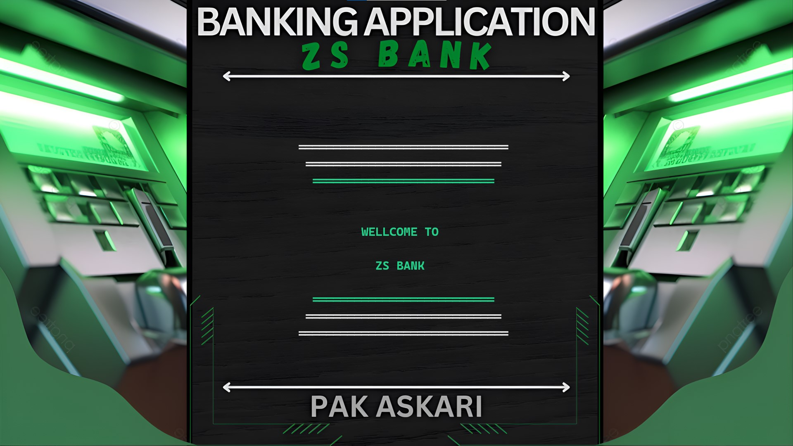

# 💳 Real‑Time Banking Application


**🏆 3rd Place – STEAM National Exhibition 2025**  
**🥇 1st Place – Regional STEAM Festival 2025**

A terminal‑based banking system written in C++ with real‑time features, Python‑driven messaging, and an offline voice assistant. Designed with a strong focus on OOP, file persistence, and user experience.



---

## ✨ Key Features

- 🔐 **Account System** – Create accounts, login, admin & user roles
- 🏧 **ATM Simulation** – PIN‑based access, deposit, withdraw, transfer
- 🧾 **Loan Management** – Request loans (user) and approve/reject (manager)
- 💬 **Real‑time Messaging** – Sends WhatsApp/SMS alerts via Python (`pywhatkit`)
- 🎙️ **Voice Feedback** – Offline text‑to‑speech using `pyttsx3`
- 🎨 **Animated Terminal UI** – Background images, colour themes, loading effects
- 📁 **Data Persistence** – All records stored in structured `.txt` files
- 📋 **Transaction Logging** – Full history with error handling

---

## 🛠️ Tech Stack

| Technology | Purpose |
|------------|---------|
| C++ | Core application logic, OOP design |
| Python | Message delivery (`pywhatkit`), voice (`pyttsx3`) |
| File I/O | Data storage (no database required) |

---

## 📁 Project Structure
```
├── main.cpp # Entry point
├── whatsapp_sender.py # SMS / WhatsApp alerts
├── bank.txt # Sample account data
├── sound/ # Audio feedbacks
├── BG-Image.png # Background image
└── README.md
```

---

## 🚀 How to Run

```bash
g++ main.cpp -o bankApp
./bankApp
```

### Prerequisites:

- **C++ compiler (g++)**
- Python 3 with `pyttsx3` and `pywhatkit` installed (`pip install pyttsx3 pywhatkit`)

### 📄 License
*MIT License – free to use, modify, and share with attribution.*

---

### 👤 Author
**Syed Zain Ali Shah**
GitHub @zainshah3464
